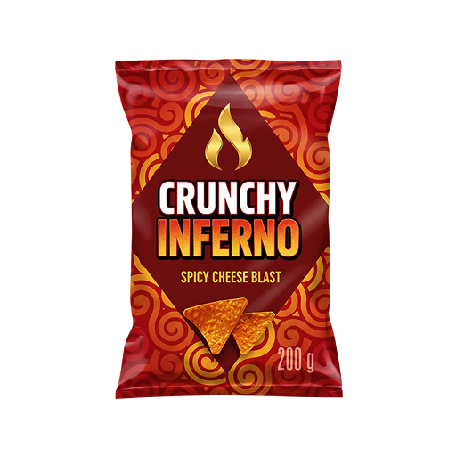
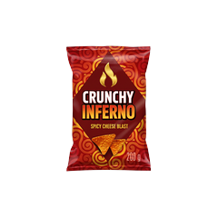

# Product Image Processor

A small AI-assisted tool that takes 100+ inconsistent product photos (different
backgrounds, sizes, padding) and turns them into a uniform set of icon assets —
background removed, product centered, sized to fit consistently inside a 60×60
circular slot, and renamed sequentially.

Built for a specific need: a Figma prototype needed 100+ product images to look
visually consistent inside circular icon slots. Rather than editing each one by
hand, this automates the repetitive part (background removal, cropping,
resizing, centering, renaming) so the design work stays focused on UX and
interaction, not production busywork.

| Before | After |
| --- | --- |
|  |  |

## How it works

1. **Background removal** — [rembg](https://github.com/danielgatis/rembg) (u2net model, runs locally) strips the original background, with alpha matting enabled for cleaner edges.
2. **Content-aware crop** — trims transparent margins so only the product remains, regardless of how much padding the source photo had.
3. **Consistent fit** — scales each product so it fills the same proportion of a 60×60 circular slot, then centers it on a transparent canvas.
4. **Sequential rename** — outputs `product-001.png`, `product-002.png`, ... with a `mapping.csv` tracking which original file became which.

Two edge cases that came up while building this, worth noting:
- Source PNGs that already had transparency sometimes had garbage RGB data hidden behind `alpha=0` (e.g. black), which bled into the new cutout as a dark fringe. Fixed by flattening onto white before background removal.
- Naively resizing an RGBA image blends background color into semi-transparent edge pixels (another source of fringing). Fixed by resizing with premultiplied alpha.

## Usage

```bash
python3 -m venv venv
source venv/bin/activate
pip install -r requirements.txt

# put source images in input/, then:
python3 process_images.py
```

Output lands in `output/` as `product-001.png`, `product-002.png`, ... at
exactly 60×60. Options:

| Flag | Default | Description |
| --- | --- | --- |
| `--input` | `input` | Source image folder |
| `--output` | `output` | Destination folder |
| `--size` | `60` | Canvas size in px |
| `--scale` | `1` | Export multiplier (e.g. `4` → 240×240 for retina) |
| `--fill-ratio` | `0.7` | How much of the circle's diagonal the product fills |
| `--prefix` | `product` | Output filename prefix |
| `--model` | `u2net` | rembg model (try `isnet-general-use` for sharper cutouts) |

The 60×60 circle spec matches this project's icon slots, but every dimension
is a flag — point it at a different size/shape spec and it still works.

## Stack

Python, [rembg](https://github.com/danielgatis/rembg) (ONNX-based background
removal), Pillow, NumPy.
